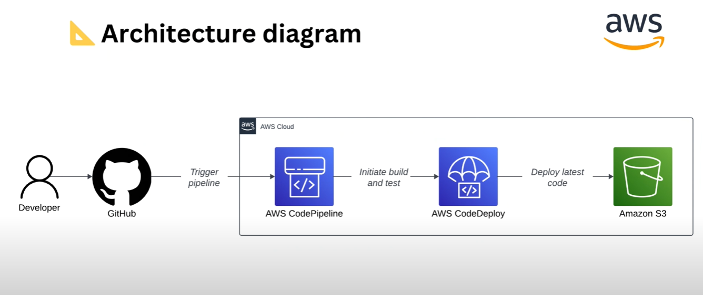

# 🧑‍💻 Alysa Emilio – Portfolio Website

This is my personal developer portfolio built to showcase my projects, skills, resume, and professional background. Designed with a clean UI using React and TailwindCSS, and deployed using Vercel and in AWS S3 bucket.

## 🔧 Tech Stack

- **Framework**: React (Vite)
- **Styling**: TailwindCSS, DaisyUI
- **Animation**: Framer Motion
- **Deployment**:
  - Vercel – For frontend deployment with GitHub integration.
  - Amazon S3 (AWS) – Static site hosted using S3 with CI/CD via CodePipeline and CodeDeploy.


## 📂 Features

- 🧠 **About Me** – Brief background and what I do
- 🛠️ **Tech Stack** – Tools and languages I use
- 🗂️ **Projects Section** – Highlighted works with links to GitHub/live demos
- 📄 **Resume** – Downloadable or viewable resume
- 📞 **Contact** – Email and socials for communication
- 🌙 **Dark Mode Support**

## 🚀 Live Demo

🔗VERCEL [Visit My Portfolio](https://alysaemilio-com.vercel.app)
🔗AWS [Visit My Portfolio](http://alysaemilio.s3-website-ap-southeast-1.amazonaws.com)


## 🌐 Deployment Architecture

Below is the AWS deployment architecture used to deploy my portfolio to an Amazon S3 bucket, using GitHub as the source and AWS services for CI/CD.



### 🛠 Workflow

1. Code is pushed to **GitHub**.
2. This triggers **AWS CodePipeline**.
3. CodePipeline initiates **build and test** steps.
4. **AWS CodeDeploy** handles the deployment.
5. Final website is hosted on **Amazon S3** as a static site.

🔗 **Live Demo on AWS**: [http://alysaemilio.s3-website-ap-southeast-1.amazonaws.com](http://alysaemilio.s3-website-ap-southeast-1.amazonaws.com)

---

## 🛠️ Run Locally

```bash
git clone https://github.com/rasberriali/alysaemilio.com.git
cd alysaemilio.com
npm install
npm run dev
